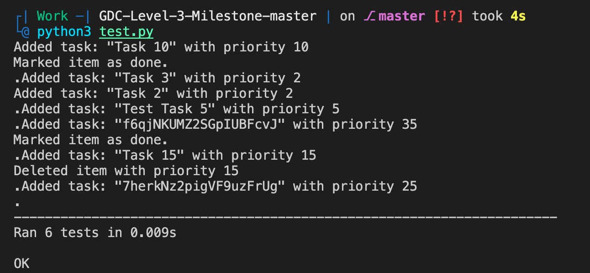

In the last milestone, we created a command line application to manage our tasks, although this is really good, it's not very user friendly and it's hard to quickly take a look at our pending tasks, to solve these issues, we will create a tiny server that can render our tasks in a nice way.

## Final Results

**Application passes all test cases**



## Usage

### 1. Help

All our existing functionality will be ported over from the last milestone, you can copy over your implementations to the new boilerplate template

```
$ python tasks.py help
Usage :-
$ python tasks.py add 2 hello world    # Add a new item with priority 2 and text "hello world" to the list
$ python tasks.py ls                   # Show incomplete priority list items sorted by priority in ascending order
$ python tasks.py del PRIORITY_NUMBER  # Delete the incomplete item with the given priority
$ python tasks.py done PRIORITY_NUMBER # Mark the incomplete item with the given priority as complete
$ python tasks.py help                 # Show usage
$ python tasks.py report               # Statistics
$ python tasks.py runserver            # Starts the tasks management server
```

The runserver command will start the server and it will keep running until we stop it manually using the keyboard combination `ctrl+c`

The boilerplate methods to render the pending and completed tasks are already done so that you can just focusing on rendering html content.

You can style the page however you want as long as the content is present.

The route for pending tasks are : https://localhost:8000/tasks
The route for completed tasks are : https://localhost:8000/completed

The methods to complete are `render_pending_tasks` and `render_completed_tasks` in the `TasksServer` class

## For Those who are looking for a challenge!

Our server can only render tasks for now, but we have learned how to use html to create forms that can be used to add new tasks.
If you are looking for a challenge, create a new page that can add new tasks, delete tasks and complete them. Its okay to fail, All the best!

## Testing

Run the test.py file to test if your submission is correct.
The test.py file will run your program and compare the output with the expected output. Any errors in your implementation will be displayed.
